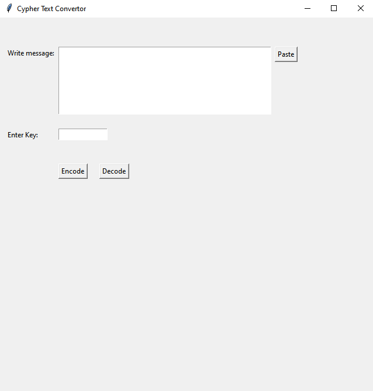
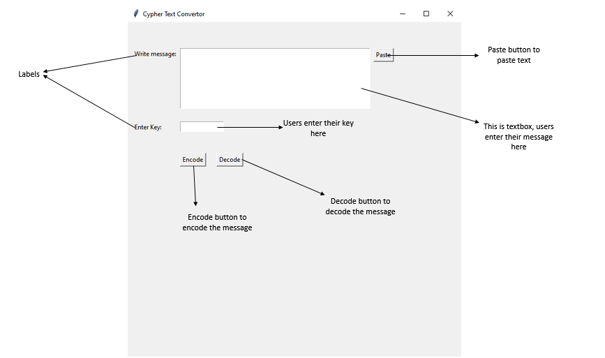
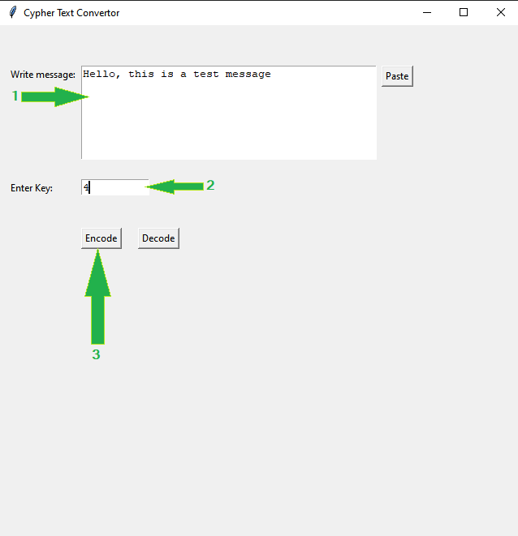
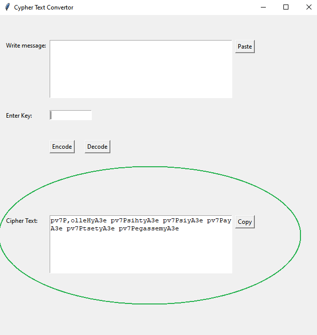
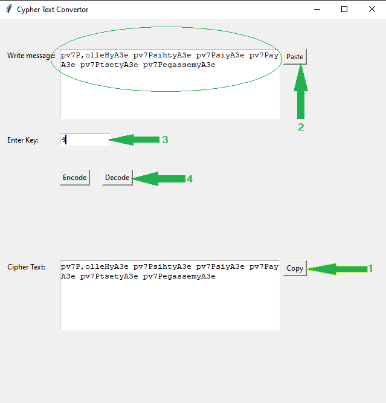
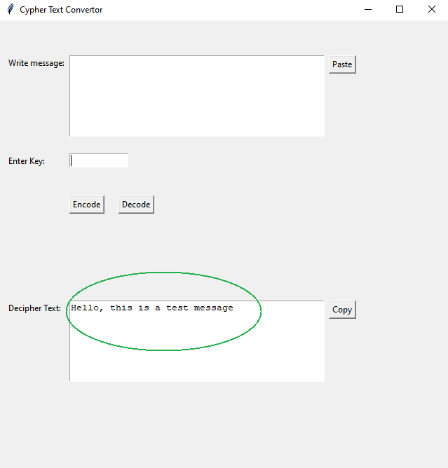
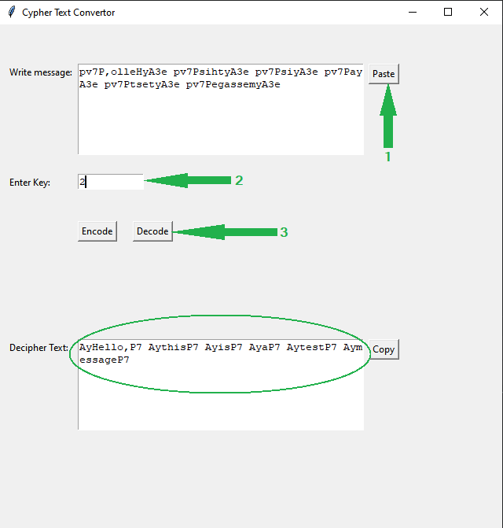

# Cipher Text Converter

Cipher Text Converter demonstrates the strength of Python in cryptography with a simple GUI. It is based on the One-time pad cryptography algorithm, which is a symmetric cryptography algorithm.

## Getting Started
First download the zip file and unzip it. Open terminal in folder where _Cipher Text Converter.py_ file and _myenv_ directory is located. Than:

For MacOS and Linux users:
```sh
source myenv\bin\activate
```

For Windows users using cmd:

```sh
myenv\Scripts\activate.bat
```

For Windows users using powershell:

```sh
myenv\Scripts\activate.ps1
```

Now run the converter:

```sh
python ".\Cipher Text Converter.py"
```

## How to use

**_Encryption_**: Enter your plaintext in the message field and any number in the key field (this number will serve as the encryption/decryption key), and then press the 'Encode' button. The encrypted message will be displayed. You can copy the encrypted text using the 'Copy' button.

**_Decryption_**: Enter your encrypted message in the message field and its encryption key (the number you entered while performing encryption), then press the 'Decode' button. The decrypted message will be displayed. You can also paste already copied text in the message field using the 'Paste' button.

### Example








